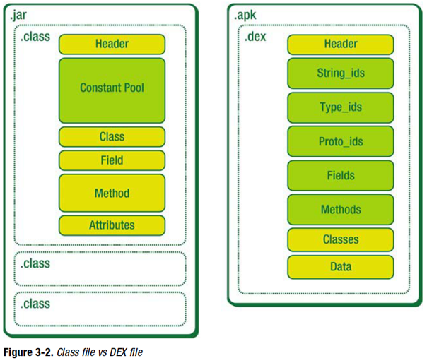

dex



## 数据结构

| 类型      | 含义                       |
| --------- | -------------------------- |
| u1        | Unit8_t1,1字节无符号数     |
| u2        | Unit16_t,2字节无符号数     |
| u4        | Unit32_t,4字节无符号数     |
| u8        | Unit64_t,8字节无符号数     |
| sleb128   | 有符号LEB128，可变长度1～5 |
| uleb128   | 无符号LEB128               |
| uleb128p1 | 无符号LEB128值加1          |

## dex文件结构

| 数据名称   | 解释                                                         |
| ---------- | ------------------------------------------------------------ |
| header     | dex文件头部，记录整个dex文件的相关属性                       |
| string_ids | 字符串数据索引，记录了每个字符串在数据区的偏移量             |
| type_ids   | 类似数据索引，记录了每个类型的字符串索引                     |
| proto_ids  | 原型数据索引，记录了方法声明的字符串，返回类型字符串，参数列表 |
| field_ids  | 字段数据索引，记录了所属类，类型以及方法名                   |
| method_ids | 类方法索引，记录方法所属类名，方法声明以及方法名等信息       |
| class_defs | 类定义数据索引，记录指定类名信息，包括接口，超类，类数据偏移量 |
| data       | 数据区，保存了各个类的真实数据                               |
| link_data  | 连接数据区                                                   |

```c++
dalvik/libdex/DexFile.h
/*
 * Structure representing a DEX file.
 *
 * Code should regard DexFile as opaque, using the API calls provided here
 * to access specific structures.
 */
struct DexFile {
    /* directly-mapped "opt" header */
    const DexOptHeader* pOptHeader;

    /* pointers to directly-mapped structs and arrays in base DEX */
    const DexHeader*    pHeader;
    const DexStringId*  pStringIds;
    const DexTypeId*    pTypeIds;
    const DexFieldId*   pFieldIds;
    const DexMethodId*  pMethodIds;
    const DexProtoId*   pProtoIds;
    const DexClassDef*  pClassDefs;
    const DexLink*      pLinkData;

    /*
     * These are mapped out of the "auxillary" section, and may not be
     * included in the file.
     */
    const DexClassLookup* pClassLookup;
    const void*         pRegisterMapPool;       // RegisterMapClassPool

    /* points to start of DEX file data */
    const u1*           baseAddr;

    /* track memory overhead for auxillary structures */
    int                 overhead;

    /* additional app-specific data structures associated with the DEX */
    //void*               auxData;
};
```

## Header

长度固定0x70，其中每一项信息所占用的内存空间也是固定的，好处是虚拟机在处理dex时不用考虑dex文件的多样性

```c++
dalvik/libdex/DexFile.h
/*
 * Direct-mapped "header_item" struct.
 */
struct DexHeader {
    u1  magic[8];           /* includes version number 值为 "dex\n035\0" */
    u4  checksum;           /* adler32 checksum 校验码 */
    u1  signature[kSHA1DigestLen]; /* SHA-1 hash sha-1签名 长度20 */
    u4  fileSize;           /* length of entire file dex文件总长度 */
    u4  headerSize;         /* offset to start of next section 文件头长度，009版本=0x5c，035版本=0x70 */
    u4  endianTag;         // 标示字节顺序的常量
    u4  linkSize;          // 链接段的大小，如果为0就是静态链接
    u4  linkOff;           // 链接段的开始位置
    u4  mapOff;            // map数据基址
    u4  stringIdsSize;     // 字符串列表中字符串个数
    u4  stringIdsOff;      // 字符串列表基址
    u4  typeIdsSize;       // 类列表里的类型个数
    u4  typeIdsOff;        // 类列表基址
    u4  protoIdsSize;      // 原型列表里面的原型个数
    u4  protoIdsOff;       // 原型列表基址
    u4  fieldIdsSize;      // 字段个数
    u4  fieldIdsOff;       // 字段列表基址
    u4  methodIdsSize;     // 方法个数
    u4  methodIdsOff;      // 方法列表基址
    u4  classDefsSize;     // 类定义标中类的个数
    u4  classDefsOff;      // 类定义列表基址
    u4  dataSize;          // 数据段的大小，必须4k对齐
    u4  dataOff;           // 数据段基址
};
```

可以使用hexdump -c classes.dex查看dex单字节显示的结果

可以用-C显示16进制和ASCII码：hexdump -C classes.dex

checksum：它是整个头部的校验和。它被用来检验头部是否损坏。

fileSize：记录包括dexHeader在内的整个dex文件大小，用来计算偏移和方便定位谋区段（section），它也有诸如唯一的标识dex，因为它是dex文件中计算sha-1区段的一个组成部分

headerSize：存放整个DexHeader结构体的长度，它也可用来计算下一个区段在文件中的起始位置，目前值为0x70

endianTag：指定dex运行环境的CPU字段序，存放的是一个固定值，所有dex文件都一样的，值为：78563412，0x12345678，标示默认采用little-endian字节序

linkOff：当多个class文件被编译到一个dex文件时，它们会用到linkSize和linkOff，通常为0 可以看到上面的，linkOff为00 00 00 00 

mapOff：它指定了dexMapList结构的文件偏移量

stringIdsSize：指string存放区段的大小，用来计算string区段起始位置-相对于dex文件加载基地址的偏移量

stringIdsOff：存放string区段的实际偏移量，单位字节。它可以帮助编译器和虚拟机直接跳到这个区段，而不必从前读到后，一直读取到该位置。type，prototype，method，class，data id的大小（size）和偏移量（offset）和string的作用一样。

每个字符串都对应一个DexStringId数据结构，大小为4B,同时虚拟机可以通过头文件中的string_ids_size知道当前dex文件中字符串的总数，也就是string_ids区域中DexStringId数据结构的总数，所以虚拟机可以通过简单的乘法运算即可实现对字符串资源的索引，也可以根据kDexTypeStringIdItem获取字符串。使用附录例子来查看下：

根据stringIdsSize找到有多少个DexStringId（也就是有多少个字符串）

0x38: 0x14 说明有20个字符串

根据stringIdsOff查看DexStringId的偏移量：

0x3c： 0x70，说明DexStringId的开始位置在0x70（目前是固定0x70即header的大小）

接下来读取4个字节：6c 01 00 00转为地址0x16c，这就是第一个字符串的位置，再读取4个字节：74 01 00 00, 0x174

分别读取的这两个位置的字符串：

06 3c 69 6e 69 74 3e 00：值为<init>\0，其中06表示后面有6个字符（不包括\0）

0b 48 65 6c  6c 6f 20 57 6f 72 6c 64 00：值为Hello World\0，0b表示有11个字符。我们 发现每个字符串是使用"\0"分割

## 分析

dalvik虚拟机解析dex文件的内容，最终将其映射成DexMapList数据结构，DexHeader中的mapOff字段指定了DexMapList结构在dex文件中的偏移，它的申明如下：

```c++
dalvik/libdex/DexFile.h
/*
 * Direct-mapped "map_list".
 */
struct DexMapList {
    u4  size;               /* #of entries in list 个数 */
    DexMapItem list[1];     /* entries DexMapItem的结构 */
};
```

size表示dex接下来有多少个DexMapItem结构

```c++
dalvik/libdex/DexFile.h
/*
 * Direct-mapped "map_item".
 */
struct DexMapItem {
    u2 type;              /* type code (see kDexType* above) kDexType开头的类型 */
    u2 unused;            /* 未使用，用于字节对齐 */
    u4 size;              /* count of items of the indicated type 类型的个数 */
    u4 offset;            /* file offset to the start of data 类型的文件偏移 */
};
```

type字段为一个枚举常量，可以通过类型名称很容易判断它的具体类型

```c++
dalvik/libdex/DexFile.h
/* map item type codes */
enum {
    kDexTypeHeaderItem               = 0x0000,
    kDexTypeStringIdItem             = 0x0001,
    kDexTypeTypeIdItem               = 0x0002,
    kDexTypeProtoIdItem              = 0x0003,
    kDexTypeFieldIdItem              = 0x0004,
    kDexTypeMethodIdItem             = 0x0005,
    kDexTypeClassDefItem             = 0x0006,
    kDexTypeCallSiteIdItem           = 0x0007,
    kDexTypeMethodHandleItem         = 0x0008,
    kDexTypeMapList                  = 0x1000,
    kDexTypeTypeList                 = 0x1001,
    kDexTypeAnnotationSetRefList     = 0x1002,
    kDexTypeAnnotationSetItem        = 0x1003,
    kDexTypeClassDataItem            = 0x2000,
    kDexTypeCodeItem                 = 0x2001,
    kDexTypeStringDataItem           = 0x2002,
    kDexTypeDebugInfoItem            = 0x2003,
    kDexTypeAnnotationItem           = 0x2004,
    kDexTypeEncodedArrayItem         = 0x2005,
    kDexTypeAnnotationsDirectoryItem = 0x2006,
};
```

以附录结构来分析，DexHeader结构的mapOff字段为f8 02 00 00（位置0x34），根据小端序，值为0x2f8，读取出的值：0e 00 00 00(0x0e)，表示接下来有14个DexMapItem结构，接着读取0x2fc值为：0x00表示这个DexMapItem类型是kDexTypeHeaderItem,再读取0x2fe值为：0x00这个字段没有使用，再读取0x300值为：01 00 00 00表示有一个，再0x304读取：00 00 00 00 表示偏移为0。

## 附录

```c++
00000000  64 65 78 0a 30 33 35 00  12 8f b1 77 7a e9 19 91  |dex.035....wz...|
00000010  f2 0c ff ce a0 ce aa cd  8f 9d 80 7a ac 18 49 bf  |...........z..I.|
00000020  a4 03 00 00 70 00 00 00  78 56 34 12 00 00 00 00  |....p...xV4.....|
00000030  00 00 00 00 f8 02 00 00  14 00 00 00 70 00 00 00  |............p...|
00000040  08 00 00 00 c0 00 00 00  05 00 00 00 e0 00 00 00  |................|
00000050  01 00 00 00 1c 01 00 00  05 00 00 00 24 01 00 00  |............$...|
00000060  01 00 00 00 4c 01 00 00  38 02 00 00 6c 01 00 00  |....L...8...l...|
00000070  6c 01 00 00 74 01 00 00  81 01 00 00 84 01 00 00  |l...t...........|
00000080  92 01 00 00 96 01 00 00  ad 01 00 00 c1 01 00 00  |................|
00000090  d5 01 00 00 f0 01 00 00  04 02 00 00 07 02 00 00  |................|
000000a0  0b 02 00 00 20 02 00 00  28 02 00 00 2e 02 00 00  |.... ...(.......|
000000b0  34 02 00 00 39 02 00 00  42 02 00 00 4c 02 00 00  |4...9...B...L...|
000000c0  03 00 00 00 05 00 00 00  06 00 00 00 07 00 00 00  |................|
000000d0  08 00 00 00 09 00 00 00  0a 00 00 00 0c 00 00 00  |................|
000000e0  02 00 00 00 03 00 00 00  00 00 00 00 04 00 00 00  |................|
000000f0  04 00 00 00 78 02 00 00  0a 00 00 00 06 00 00 00  |....x...........|
00000100  00 00 00 00 0b 00 00 00  06 00 00 00 78 02 00 00  |............x...|
00000110  0b 00 00 00 06 00 00 00  70 02 00 00 05 00 01 00  |........p.......|
00000120  10 00 00 00 00 00 04 00  0f 00 00 00 01 00 03 00  |................|
00000130  11 00 00 00 04 00 02 00  00 00 00 00 04 00 01 00  |................|
00000140  0d 00 00 00 04 00 00 00  12 00 00 00 00 00 00 00  |................|
00000150  01 00 00 00 02 00 00 00  00 00 00 00 ff ff ff ff  |................|
00000160  00 00 00 00 f0 02 00 00  00 00 00 00 06 3c 69 6e  |.............<in|
00000170  69 74 3e 00 0b 48 65 6c  6c 6f 20 57 6f 72 6c 64  |it>..Hello World|
00000180  00 01 4c 00 0c 4c 48 65  6c 6c 6f 57 6f 72 6c 64  |..L..LHelloWorld|
00000190  3b 00 02 4c 4c 00 15 4c  6a 61 76 61 2f 69 6f 2f  |;..LL..Ljava/io/|
000001a0  50 72 69 6e 74 53 74 72  65 61 6d 3b 00 12 4c 6a  |PrintStream;..Lj|
000001b0  61 76 61 2f 6c 61 6e 67  2f 4f 62 6a 65 63 74 3b  |ava/lang/Object;|
000001c0  00 12 4c 6a 61 76 61 2f  6c 61 6e 67 2f 53 74 72  |..Ljava/lang/Str|
000001d0  69 6e 67 3b 00 19 4c 6a  61 76 61 2f 6c 61 6e 67  |ing;..Ljava/lang|
000001e0  2f 53 74 72 69 6e 67 42  75 69 6c 64 65 72 3b 00  |/StringBuilder;.|
000001f0  12 4c 6a 61 76 61 2f 6c  61 6e 67 2f 53 79 73 74  |.Ljava/lang/Syst|
00000200  65 6d 3b 00 01 56 00 02  56 4c 00 13 5b 4c 6a 61  |em;..V..VL..[Lja|
00000210  76 61 2f 6c 61 6e 67 2f  53 74 72 69 6e 67 3b 00  |va/lang/String;.|
00000220  06 61 70 70 65 6e 64 00  04 61 72 67 73 00 04 6d  |.append..args..m|
00000230  61 69 6e 00 03 6f 75 74  00 07 70 72 69 6e 74 6c  |ain..out..printl|
00000240  6e 00 08 74 6f 53 74 72  69 6e 67 00 0e e8 bf 99  |n..toString.....|
00000250  e6 98 af e4 b8 80 e4 b8  aa e6 89 8b e5 86 99 e7  |................|
00000260  9a 84 73 6d 61 6c 69 e5  ae 9e e4 be 8b 00 00 00  |..smali.........|
00000270  01 00 00 00 07 00 00 00  01 00 00 00 03 00 00 00  |................|
00000280  00 00 00 00 00 00 00 00  00 01 0f 07 00 00 00 00  |................|
00000290  0b 00 01 00 02 00 00 00  88 02 00 00 28 00 00 00  |............(...|
000002a0  62 00 00 00 00 00 00 00  00 00 12 32 13 03 ff ff  |b..........2....|
000002b0  18 04 00 00 01 00 00 00  00 00 1c 05 03 00 01 26  |...............&|
000002c0  22 07 04 00 70 10 02 00  07 00 1a 08 13 00 6e 20  |"...p.........n |
000002d0  03 00 87 00 0c 07 6e 10  04 00 07 00 0c 09 6e 20  |......n.......n |
000002e0  01 00 90 00 1a 01 01 00  6e 20 01 00 10 00 0e 00  |........n ......|
000002f0  00 00 01 00 00 09 90 05  0e 00 00 00 00 00 00 00  |................|
00000300  01 00 00 00 00 00 00 00  01 00 00 00 14 00 00 00  |................|
00000310  70 00 00 00 02 00 00 00  08 00 00 00 c0 00 00 00  |p...............|
00000320  03 00 00 00 05 00 00 00  e0 00 00 00 04 00 00 00  |................|
00000330  01 00 00 00 1c 01 00 00  05 00 00 00 05 00 00 00  |................|
00000340  24 01 00 00 06 00 00 00  01 00 00 00 4c 01 00 00  |$...........L...|
00000350  02 20 00 00 14 00 00 00  6c 01 00 00 01 10 00 00  |. ......l.......|
00000360  02 00 00 00 70 02 00 00  03 10 00 00 02 00 00 00  |....p...........|
00000370  80 02 00 00 03 20 00 00  01 00 00 00 88 02 00 00  |..... ..........|
00000380  01 20 00 00 01 00 00 00  90 02 00 00 00 20 00 00  |. ........... ..|
00000390  01 00 00 00 f0 02 00 00  00 10 00 00 01 00 00 00  |................|
000003a0  f8 02 00 00                                       |....|
000003a4
```

