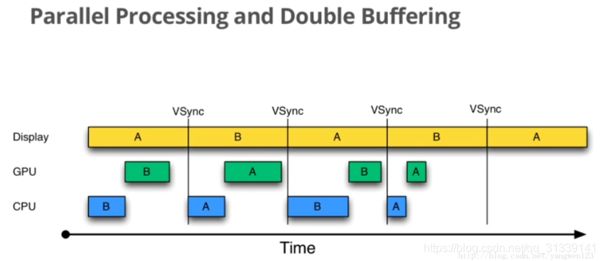

surface

在介绍本篇之前先理解下渲染的一些东西。

## 60fps？

当达到24fps时，人眼会看到流畅的画面，24fps在电影行业非常普遍，因为它对展现动作来说已经足够，同时制作成本也足够低能满足电影制作的预算，但还要多亏运动模糊这些视觉效果才能让我们在看电影时仍能有流畅的画面。

**60fps足够”欺骗“人类大脑感受应用流畅和很好的用户体验**

**设备刷新频率硬件固定参数是60Hz，主要考量功耗、屏幕设计、电池续航能力、成本等因素，目前60Hz是能兼顾流畅体验和硬件要求成本的数值，帧率需要和刷新频率同步**

## 屏幕撕裂和Double Buffer（双重缓存）

#### 屏幕撕裂

刷新出一帧数据显示到屏幕上会经过三个步骤：

- CPU将控件解析计算为polygons多边形和textures纹理
- polygons和textures交由GPU将这些数据进行栅格化
- 硬件负责把栅格化后的内容呈现到屏幕上，显示出一帧


CPU/GPU生成图像数据写入到Buffer，屏幕从Buffer中读取数据，两者使用的同一个Buffer不停的进行协作：


理想情况下帧率和刷新频率保持一致，即每绘制完一帧显示一帧。

不幸的是，帧率和刷新频率并不总是保持相对同步：GPU写入数据的Buffer和屏幕读取数据的Buffer是同一个，当帧率比刷新频率快时（即读取速度比写入速度慢），比如帧率120fps，刷新频率60Hz，当GPU已经写入一帧数据到Buffer，新一帧部分内容也写到了Buffer，当屏幕刷新时，它并不知道Buffer的状态并读取了Buffer中并不完整的一帧画面：


此时屏幕显示的图像会出现上半部分和下半部分明显偏差的现象，这种情况被称为tearing屏幕撕裂。

### Double Buffer和VSync

帧率和刷新频率不一致并且操作同一个Buffer导致的tearing现象，解决这个问题的办法就是使用Double Buffer双重缓冲，让GPU和显示器各自拥有一个Buffer缓冲区。GPU始终将完成的一帧图像数据写入到Back Buffer，而显示器使用Frame Buffer读取显示。

但也出现一个问题：什么时候将Back Buffer数据交换显示到Frame Buffer？假如Back Buffer准备完成帧数据后就进行交换，如果此时屏幕还没有完整显示上一帧的内容，还是会出现tearing问题。只能是等到屏幕处理完一帧数据后，才可以执行这一步操作。

一个典型的显示器有两个重要的特性：行频和场频。行频（Horizontal Scanning Frequency）又称为水平扫描频率，是屏幕每秒从左到右扫描的次数；场频（Vertical Scanning Frequency）又称为垂直扫描频率，是每秒整个屏幕刷新的次数。它们的关系：行频=场频*纵坐标分辨率。

当扫描完一个屏幕后，设备需要重新回到第一行以进行下一次循环，此时有一段时间空隙称为Vertical Blacking Interval（VBI），在这个时间点就是进行缓冲区交换的最佳时间，因为屏幕此时没有在刷新，也就避免了交换过程中出现tearing的情况。Vsync（Vertical Synchronization）垂直同步，它利用VBI保证双缓冲在最佳时间点进行交换。

当GPU将一帧数据写入到Back Buffer时，VSync信号调度Back Buffer将图形数据copy到Frame Buffer（copy并不是真正的数据copy，实际是交换各自的内存地址，可以认为是瞬时完成的）。


## Jank和Triple Buffer（三重缓冲）

### Jank

从上面我们了解到，一帧数据绘制最终显示到屏幕是需要经过CPU对控件计算转换为polygons多边形和textures纹理，然后交由GPU栅格化，最终才把一帧显示到屏幕，三步操作在帧率为60fps和刷新频率为60Hz的情况下，要求我们在16ms内完成这些工作。

在没有VSync同步时，当CPU/GPU绘制过慢时会出现如下情况：


图中有三个元素，Display是显示屏幕，CPU和GPU负责渲染帧数据，每个帧以方框表示，并以数据编号，VSync用于指导双缓冲区的交换。以时间顺序看下发生的异常：

- Step1: Display显示第0帧数据，此时CPU和GPU渲染第一帧画面，而且赶在Display显示下一帧前完成
- Step2: 因为渲染及时，Display在第0帧显示完成后，也就是第一个Vsync后正常显示第一帧
- Step3: 由于某些原因，比如CPU资源被占用，系统没有及时的开始处理第2帧，直到第2个VSync快来之前才开始处理
- Step4: 第2个VSync来时，由于第2帧数据还没有准备就绪，显示的还是第1帧。这种情况被称为Jank

第2帧数据准备完成后，它并不会马上被显示，而是要等待下一个VSync。所以总的来说，就是屏幕平白无故地多显示了一次第一帧。原因就是CPU没有及时地开始着手第2帧的渲染工作导致。

如何让第2帧被及时绘制呢？这就是我们在Graphic系统中引入Vsync的原因：


如上图所示，一旦VSync出现后，就立刻开始执行下一帧的绘制工作。这样就可以大大降低Jank出现的概率。

另外，VSync引入后，要求绘制也只能在接收到VSync信号之后才能进行，因此，也就杜绝了另外一种极端情况的出现-CPU（GPU）一直不停的进行绘制，帧的生成速度高于屏幕的刷新速度，导致生成的帧不能被显示，只能丢弃，这样就出现了丢帧的情况-引入VSync后，绘制的速度就和屏幕刷新的速度保持一致了。

### Triple Buffer（三重缓冲）

在正常情况下，采用双缓冲和VSync的运行情况如下：



虽然上图CPU和GPU处理所用的时间有时长有时短，但总的来说都是在16ms以内因此不影响效果，A和B两个缓冲区不断交换来正确显示画面。

大部分Android显示设备刷新频率是60Hz，意味着每一帧最多只能有1/60=16ms左右的准备时间，但我们没有办法保证所有设备的硬件配置都能达到这个要求，假如CPU/GPU性能无法满足，将会发生如下情况：


由上图可知：

- 在第二个16ms时间段内，Display本应该显示B帧，但却因为GPU还在处理B帧导致A帧被重复显示
- 同理，在第二个16ms时间段内，CPU无所事事，因为A Buffer被Display使用，B Buffer被GPU使用，一旦过了VSync信号周期，CPU就不能被触发处理绘制工作了

解决上诉问题的方式就是使用Triple Buffer三重缓冲，其实就是在双重缓冲的基础上再增加一个Graphic Buffer缓冲区提供给CPU，这样就可以最大限度地利用空闲时间，带来的坏处就是多使用了一个Graphic Buffer所占用的内存。


在第二个16ms时间段，CPU使用C Buffer完成绘图工作，虽然还是会多显示一次A帧，但后续显示就比较流畅了，有效避免Jank的进一步加剧。

无论是CPU将控件计算转换为多边形和纹理，还是GPU栅格化，甚至CPU将数据传到GPU，这些都是耗时的操作，如果实际项目中View层级太多或过度绘制严重，将会导致这些处理有更大的耗时。

在Android中Chroeographer是配合VSync进行系统协调的类，注册监听VSync信号进行界面绘制刷新。后面会详细介绍其中的实现。

在Android 5.0引入了两个比较大的改变。一个是引入RenderNode概念， 它对DisplayList及一些View显示属性做了进一步封装；另一个是引入了RenderThread，所有的GL命令执行都放到这个线程上，渲染线程在RenderNode中存有渲染帧的所有信息，可以做一些属性动画，这样即便主线程有耗时操作时也可以保证动画流畅。


CPU将数据同步给GPU之后，一般不会阻塞等待GPU渲染完毕，而是通知结束后就返回。而RenderThread承担了比较多的绘制工作，分担了主线程很多压力，提高了UI线程的响应速度。

## 源码分析

分析应用层代码时需要分清Activity、Window、PhoneWindow、DecorView这几个类之间的关系，如下图所示：


Window是抽象类，PhoneWindow是Window类的实现.

一个Activity的启动，在调用StartActivity时，会通过ContextImpl->mainThread(ActivityThread)->->Instrumentation->ActivityManagerService(AMS)的startActivity方法

surface创建的过程就是Activity显示的过程，在ActivityThread.handleResumeActivity()中调用了Activity.makeVisible，从makeVisible开始逐步分析

SurfaceComposerClient 对象， 作为跟 SurfaceFlinger 通信的代理对象。

```java
frameworks/base/core/java/android/app/Activity.java
    void makeVisible() {
        if (!mWindowAdded) {
            ViewManager wm = getWindowManager(); // 此处获取的是WindowManagerImpl对象
            wm.addView(mDecor, getWindow().getAttributes());
            mWindowAdded = true;
        }
        mDecor.setVisibility(View.VISIBLE);
    }
```

```java
frameworks/base/core/java/android/view/WindowManagerImpl.java
    public void addView(@NonNull View view, @NonNull ViewGroup.LayoutParams params) {
        applyDefaultToken(params);
        mGlobal.addView(view, params, mContext.getDisplay(), mParentWindow);
    }
```

```java
frameworks/base/core/java/android/view/WindowManagerGlobal.java
    public void addView(View view, ViewGroup.LayoutParams params,
            Display display, Window parentWindow) {
  			.....

        ViewRootImpl root;
        View panelParentView = null;

        synchronized (mLock) {
            .....
            root = new ViewRootImpl(view.getContext(), display); // 创建ViewRootImpl对象

            view.setLayoutParams(wparams);
           
            mViews.add(view); // View列表对象
            mRoots.add(root); // ViewRootImpl列表对象
            mParams.add(wparams);
           ....
        }
    }
```

在创建ViewRootImpl时，会new Surface，此时创建的Surface什么都没有

```java
frameworks/base/core/java/android/view/ViewRootImpl.java
    public ViewRootImpl(Context context, Display display) {
        mContext = context;
        mWindowSession = WindowManagerGlobal.getWindowSession();
        mDisplay = display;
        mBasePackageName = context.getBasePackageName();
        mThread = Thread.currentThread(); // 主线程
        ....
    }
```

```java
frameworks/base/core/java/android/view/WindowManagerGlobal.java
     public static IWindowSession getWindowSession() {
        synchronized (WindowManagerGlobal.class) {
            if (sWindowSession == null) {
                try {
                    // 获取IMS的代理类
                    InputMethodManager imm = InputMethodManager.getInstance();
                    // 获取WMS的代理类
                    IWindowManager windowManager = getWindowManagerService();
                    // 通过Binder滴哦啊用，最终调用WMS
                    sWindowSession = windowManager.openSession(
                            new IWindowSessionCallback.Stub() {
                                @Override
                                public void onAnimatorScaleChanged(float scale) {
                                    ValueAnimator.setDurationScale(scale);
                                }
                            },
                            imm.getClient(), imm.getInputContext());
                } catch (RemoteException e) {
                    throw e.rethrowFromSystemServer();
                }
            }
            return sWindowSession;
        }
    }
```

```java
frameworks/base/services/core/java/com/android/server/wm/WindowManagerService.java
    public IWindowSession openSession(IWindowSessionCallback callback, IInputMethodClient client,
            IInputContext inputContext) {
        if (client == null) throw new IllegalArgumentException("null client");
        if (inputContext == null) throw new IllegalArgumentException("null inputContext");
        Session session = new Session(this, callback, client, inputContext);
        return session;
    }
```

创建完ViewRootImpl对象后，接着调用该对象的setView方法

```java
frameworks/base/core/java/android/view/ViewRootImpl.java
    public void setView(View view, WindowManager.LayoutParams attrs, View panelParentView) {
        synchronized (this) {
            if (mView == null) {
              ....
                int res; /* = WindowManagerImpl.ADD_OKAY; */
                // Schedule the first layout -before- adding to the window
                // manager, to make sure we do the relayout before receiving
                // any other events from the system.
                requestLayout();
              ....
                try {
                    .....
                    // 通过Binder调用，进入system进程的Session
                    res = mWindowSession.addToDisplay(mWindow, mSeq, mWindowAttributes,
                            getHostVisibility(), mDisplay.getDisplayId(), mWinFrame,
                            mAttachInfo.mContentInsets, mAttachInfo.mStableInsets,
                            mAttachInfo.mOutsets, mAttachInfo.mDisplayCutout, mInputChannel);
                } catch (RemoteException e) {
                    ...
                } finally {
                    ...
                }
								.......
            }
        }
    }
```

```java
frameworks/base/services/core/java/com/android/server/wm/Session.java
    public int addToDisplay(IWindow window, int seq, WindowManager.LayoutParams attrs,
            int viewVisibility, int displayId, Rect outFrame, Rect outContentInsets,
            Rect outStableInsets, Rect outOutsets,
            DisplayCutout.ParcelableWrapper outDisplayCutout, InputChannel outInputChannel) {
        // 调用WMS的addWindow
        return mService.addWindow(this, window, seq, attrs, viewVisibility, displayId, outFrame,
                outContentInsets, outStableInsets, outOutsets, outDisplayCutout, outInputChannel);
    }
```

```java
frameworks/base/services/core/java/com/android/server/wm/WindowManagerService.java
    public int addWindow(Session session, IWindow client, int seq,
            LayoutParams attrs, int viewVisibility, int displayId, Rect outFrame,
            Rect outContentInsets, Rect outStableInsets, Rect outOutsets,
            DisplayCutout.ParcelableWrapper outDisplayCutout, InputChannel outInputChannel) {
        int[] appOp = new int[1]; // 每一个Op对应一个绘制对象
        ...
        WindowState parentWindow = null;
        long origId;
        final int callingUid = Binder.getCallingUid();
        final int type = attrs.type;

        synchronized(mWindowMap) {
            ...
            AppWindowToken atoken = null;
            final boolean hasParent = parentWindow != null;
            // Use existing parent window token for child windows since they go in the same token
            // as there parent window so we can apply the same policy on them.
            WindowToken token = displayContent.getWindowToken(
                    hasParent ? parentWindow.mAttrs.token : attrs.token);
            // If this is a child window, we want to apply the same type checking rules as the
            // parent window type.
            final int rootType = hasParent ? parentWindow.mAttrs.type : type;

            boolean addToastWindowRequiresToken = false;
            ....
            // 创建WindowState对象
            final WindowState win = new WindowState(this, session, client, token, parentWindow,
                    appOp[0], seq, attrs, viewVisibility, session.mUid,
                    session.mCanAddInternalSystemWindow);
            ...
            // 调整WindowManager的LayoutParam参数
            mPolicy.adjustWindowParamsLw(win, win.mAttrs, hasStatusBarServicePermission);
            win.setShowToOwnerOnlyLocked(mPolicy.checkShowToOwnerOnly(attrs));

            res = mPolicy.prepareAddWindowLw(win, attrs);
            if (res != WindowManagerGlobal.ADD_OKAY) {
                return res;
            }
            ...
            win.attach();
            mWindowMap.put(client.asBinder(), win);
            win.initAppOpsState();
            ...
            final boolean hideSystemAlertWindows = !mHidingNonSystemOverlayWindows.isEmpty();
            win.setForceHideNonSystemOverlayWindowIfNeeded(hideSystemAlertWindows);
            ...
            final AppWindowToken aToken = token.asAppWindowToken();
            ...
            boolean imMayMove = true;

            win.mToken.addWindow(win);
            ....
        }
        ...
        return res;
    }
```

接下来看下WindowState的attach方法

```java
frameworks/base/services/core/java/com/android/server/wm/WindowState.java
    void attach() {
        if (localLOGV) Slog.v(TAG, "Attaching " + this + " token=" + mToken);
        mSession.windowAddedLocked(mAttrs.packageName);
    }
```

```java
frameworks/base/services/core/java/com/android/server/wm/Session.java
    void windowAddedLocked(String packageName) {
        mPackageName = packageName;
        mRelayoutTag = "relayoutWindow: " + mPackageName;
        if (mSurfaceSession == null) {
            if (WindowManagerService.localLOGV) Slog.v(
                TAG_WM, "First window added to " + this + ", creating SurfaceSession");
            mSurfaceSession = new SurfaceSession();
            if (SHOW_TRANSACTIONS) Slog.i(
                    TAG_WM, "  NEW SURFACE SESSION " + mSurfaceSession);
            mService.mSessions.add(this);
            if (mLastReportedAnimatorScale != mService.getCurrentAnimatorScale()) {
                mService.dispatchNewAnimatorScaleLocked(this);
            }
        }
        mNumWindow++;
    }
```

这里创建了SurfaceSession对象，并将当前Session添加到WMS.mSessions中，SurfaceSession的创建会调用JNI的nativeCreate方法。

```c++
frameworks/base/core/jni/android_view_SurfaceSession.cpp
static jlong nativeCreate(JNIEnv* env, jclass clazz) {
    SurfaceComposerClient* client = new SurfaceComposerClient();
    client->incStrong((void*)nativeCreate);
    return reinterpret_cast<jlong>(client);
}
```

创建SurfaceComposerClient对象实现Binder，作为跟SurfaceFlinger通信的代理对象。

### requestLayout

View中的requestLayout会调用到ViewRootImpl中的requestLayout。

```java
frameworks/base/core/java/android/view/View.java
    public void requestLayout() {
        if (mMeasureCache != null) mMeasureCache.clear();

        if (mAttachInfo != null && mAttachInfo.mViewRequestingLayout == null) {
            // Only trigger request-during-layout logic if this is the view requesting it,
            // not the views in its parent hierarchy
            ViewRootImpl viewRoot = getViewRootImpl();
            if (viewRoot != null && viewRoot.isInLayout()) {
                if (!viewRoot.requestLayoutDuringLayout(this)) {
                    return;
                }
            }
            mAttachInfo.mViewRequestingLayout = this;
        }

        mPrivateFlags |= PFLAG_FORCE_LAYOUT;
        mPrivateFlags |= PFLAG_INVALIDATED;

        if (mParent != null && !mParent.isLayoutRequested()) {
            mParent.requestLayout(); // 这里的mParent就是ViewRootImpl
        }
        if (mAttachInfo != null && mAttachInfo.mViewRequestingLayout == this) {
            mAttachInfo.mViewRequestingLayout = null;
        }
    }
```

```java
frameworks/base/core/java/android/view/ViewRootImpl.java
    public void requestLayout() {
        if (!mHandlingLayoutInLayoutRequest) {
            checkThread();
            mLayoutRequested = true;
            scheduleTraversals();
        }
    }

    void scheduleTraversals() {
        if (!mTraversalScheduled) {
            mTraversalScheduled = true;
            // 往消息队列插入一个同步屏障，保证异步消息优先执行
            mTraversalBarrier = mHandler.getLooper().getQueue().postSyncBarrier();
            mChoreographer.postCallback(
                    Choreographer.CALLBACK_TRAVERSAL, mTraversalRunnable, null);
            if (!mUnbufferedInputDispatch) {
                scheduleConsumeBatchedInput();
            }
            notifyRendererOfFramePending();
            pokeDrawLockIfNeeded();
        }
    }

    final class TraversalRunnable implements Runnable {
        @Override
        public void run() {
            doTraversal();
        }
    }
```

这里需要注意handler中插入同步栏栅，为了保证后续的choreographer任务优先执行，看下Choreographer构造函数，就能理解这里mHanlder加入屏障后为什么能保证后续的postCallback能优先执行

```java
frameworks/base/core/java/android/view/Choreographer.java
    public static Choreographer getInstance() {
        return sThreadInstance.get();
    }

    // Thread local storage for the choreographer.
    private static final ThreadLocal<Choreographer> sThreadInstance =
            new ThreadLocal<Choreographer>() {
        @Override
        protected Choreographer initialValue() {
            Looper looper = Looper.myLooper();
            if (looper == null) {
                throw new IllegalStateException("The current thread must have a looper!");
            }
            Choreographer choreographer = new Choreographer(looper, VSYNC_SOURCE_APP);
            if (looper == Looper.getMainLooper()) {
                mMainInstance = choreographer;
            }
            return choreographer;
        }
    };

```

Choreographer是线程单例，在ViewRootImpl创建Choreographer和mHandler是使用的同一个looper。继续看postCallback后续内容，上面的doTraversal会调用performTraversal，其中会调用view的measure、layout及draw，而这里的doTraversal被封装成任务放入到mChoreographer对应的任务列表中，后续等接收到Vsync脉冲使进行调用。

#### Choreographer

直译：编舞者；看下官方对类的注释

```
协调动画，输入和绘图的时间安排。
choreographer接收从显示子系统定时脉冲（例如垂直同步），然后安排工作以渲染下一个显示帧。
应用程序通常使用动画框架或视图层次结构中的更高级别的抽象间接与编排器交互。
```

Choreographer中变量USE_VSYNC用于表示系统是否使用了Vsync同步机制，该值是通过读取系统属性debug.choreographer.vsync来获取的。如果系统使用了Vsync同步机制，则创建一个FrameDisplayEventReceiver对象用于请求并接收Vsync事件，最后Choreographer创建了一个大小为3+1的CallbackQueue队列数组，用于保存不同类型的Callback。

```java
    private Choreographer(Looper looper, int vsyncSource) {
        mLooper = looper;
        mHandler = new FrameHandler(looper);
        mDisplayEventReceiver = USE_VSYNC
                ? new FrameDisplayEventReceiver(looper, vsyncSource)
                : null;
        mLastFrameTimeNanos = Long.MIN_VALUE;

        mFrameIntervalNanos = (long)(1000000000 / getRefreshRate());

        mCallbackQueues = new CallbackQueue[CALLBACK_LAST + 1];
        for (int i = 0; i <= CALLBACK_LAST; i++) {
            mCallbackQueues[i] = new CallbackQueue();
        }
        // b/68769804: For low FPS experiments.
        setFPSDivisor(SystemProperties.getInt(ThreadedRenderer.DEBUG_FPS_DIVISOR, 1));
    }
```

接着上节所诉postCallback继续看事件的触发机制

```java
frameworks/base/core/java/android/view/Choreographer.java
    public void postCallback(int callbackType, Runnable action, Object token) {
        postCallbackDelayed(callbackType, action, token, 0);
    }
```

这里调用的是postCallback，还有一个类似的方法postFrameCallback，postCallback相比postFrameCallback更灵活，他们最终都会调用postCallbackDelayedInternal方法

```java
frameworks/base/core/java/android/view/Choreographer.java
    private void postCallbackDelayedInternal(int callbackType,
            Object action, Object token, long delayMillis) {
      ...
        synchronized (mLock) {
            final long now = SystemClock.uptimeMillis();
            final long dueTime = now + delayMillis;
            mCallbackQueues[callbackType].addCallbackLocked(dueTime, action, token);

            if (dueTime <= now) { // 马上执行
                scheduleFrameLocked(now);
            } else { // 发送handler，在指定时间执行
                Message msg = mHandler.obtainMessage(MSG_DO_SCHEDULE_CALLBACK, action);
                msg.arg1 = callbackType;
                msg.setAsynchronous(true); // 设置为异步消息，不受同步屏障影响
                mHandler.sendMessageAtTime(msg, dueTime);
            }
        }
    }
```

上面即使调用mHandler发送消息，但是到点后还是会调用scheduleFrameLocked方法

```java
frameworks/base/core/java/android/view/Choreographer.java
    private void scheduleFrameLocked(long now) {
        if (!mFrameScheduled) {
            mFrameScheduled = true;
            if (USE_VSYNC) {
                // If running on the Looper thread, then schedule the vsync immediately,
                // otherwise post a message to schedule the vsync from the UI thread
                // as soon as possible.
                if (isRunningOnLooperThreadLocked()) { // 在当前线程上执行
                    scheduleVsyncLocked();
                } else { // 发送handler消息执行，不受同步屏障影响
                    Message msg = mHandler.obtainMessage(MSG_DO_SCHEDULE_VSYNC);
                    msg.setAsynchronous(true);
                    mHandler.sendMessageAtFrontOfQueue(msg);
                }
            } else {
                final long nextFrameTime = Math.max(
                        mLastFrameTimeNanos / TimeUtils.NANOS_PER_MS + sFrameDelay, now);
                Message msg = mHandler.obtainMessage(MSG_DO_FRAME);
                msg.setAsynchronous(true);
                mHandler.sendMessageAtTime(msg, nextFrameTime);
            }
        }
    }
```

这里使用到了USE_VSYNC标记，如果设备不支持同步机制，则模拟Vsync信号

```java
frameworks/base/core/java/android/view/Choreographer.java
    private void scheduleVsyncLocked() {
        mDisplayEventReceiver.scheduleVsync();
    }
```


```java
frameworks/base/core/java/android/view/DisplayEventReceiver.java
    /**
     * Schedules a single vertical sync pulse to be delivered when the next
     * display frame begins.
     */
    public void scheduleVsync() {
        if (mReceiverPtr == 0) {
            Log.w(TAG, "Attempted to schedule a vertical sync pulse but the display event "
                    + "receiver has already been disposed.");
        } else {
            // mReceiverPtr是Native层一个类的指针地址
            // 这里这个类指的是底层NativeDisplayEventReceiver这个类
            // nativeScheduleVsync底层会调用到requestNextVsync（）去请求下一个Vsync，
            // 涉及到各种描述符监听以及跨进程数据传输
            nativeScheduleVsync(mReceiverPtr);
        }
    }
```

这里出现了DisplayEventReceiver抽象类，它的实现在Choreographer的内部类FrameDisplayEventReceiver。nativeScheduleVsync方法注册监听下一次刷新事件，每一次调用才能回调一次，底层回调时会调用DisplayEventReceiver的onVsync方法，最后会调用之前提到的注册的Callback，正如上面postCallback注册的事件一样。向上步骤不再说明，这里再往下探究下刷新事件的注册

```c++
frameworks/base/core/jni/android_view_DisplayEventReceiver.cpp
static void nativeScheduleVsync(JNIEnv* env, jclass clazz, jlong receiverPtr) {
    sp<NativeDisplayEventReceiver> receiver =
            reinterpret_cast<NativeDisplayEventReceiver*>(receiverPtr);
    status_t status = receiver->scheduleVsync();
    if (status) {
        String8 message;
        message.appendFormat("Failed to schedule next vertical sync pulse.  status=%d", status);
        jniThrowRuntimeException(env, message.string());
    }
}
```

这里调用了NativeDisplayEventReceiver继承自DisplayEventReceiver

```c++
frameworks/base/libs/androidfw/DisplayEventDispatcher.cpp
status_t DisplayEventDispatcher::scheduleVsync() {
    if (!mWaitingForVsync) {
        ALOGV("dispatcher %p ~ Scheduling vsync.", this);

        // Drain all pending events.
        nsecs_t vsyncTimestamp;
        int32_t vsyncDisplayId;
        uint32_t vsyncCount;
        if (processPendingEvents(&vsyncTimestamp, &vsyncDisplayId, &vsyncCount)) {
            ALOGE("dispatcher %p ~ last event processed while scheduling was for %" PRId64 "",
                    this, ns2ms(static_cast<nsecs_t>(vsyncTimestamp)));
        }

        status_t status = mReceiver.requestNextVsync(); // BnDisplayEventConnection, IDisplayEventConnection.h
        if (status) {
            ALOGW("Failed to request next vsync, status=%d", status);
            return status;
        }

        mWaitingForVsync = true;
    }
    return OK;
}
```

mWaitingForVsync默认为false

```c++
frameworks/native/libs/gui/DisplayEventReceiver.cpp
status_t DisplayEventReceiver::requestNextVsync() {
    if (mEventConnection != NULL) {
        mEventConnection->requestNextVsync();
        return NO_ERROR;
    }
    return NO_INIT;
}
```

mEventConnection是BpDisplayEventConnection对象，为Binder的客户端，通过Binder调用

```c++
 frameworks/native/libs/gui/IDisplayEventConnection.cpp
    void requestNextVsync() override {
        callRemoteAsync<decltype(&IDisplayEventConnection::requestNextVsync)>(
                Tag::REQUEST_NEXT_VSYNC);
    }
```

这里的DisplayEventConnection为客户端，对应SurfaceFlinger的EventThread类，所以上诉callRemoteAsync会调用到服务端的对应方法

```c++
frameworks/native/services/surfaceflinger/EventThread.cpp
void EventThread::Connection::requestNextVsync() {
    mEventThread->requestNextVsync(this);
}

void EventThread::requestNextVsync(const sp<EventThread::Connection>& connection) {
    std::lock_guard<std::mutex> lock(mMutex);

    if (mResyncWithRateLimitCallback) {
        mResyncWithRateLimitCallback();
    }

    if (connection->count < 0) {
        connection->count = 0;
        mCondition.notify_all();
    }
}
```

将条件变量唤醒，等待HW层的Vsync事件；EventThread在创建的时候进入waitForEventLocked等待。

- EventThread::Connection::Connection Connection的构造函数.用于进程间的通信by BitTube..在此处主要是搭建一个通路(BitTube)来完成client(App 或SurfaceFlinger)对Vsyncevent 事件的请求(通过requestNextVsync)和EventThread把SW-Vsyncevent callback 到其感兴趣的client.需要注意的是App是通过SurfaceFlinger::createDisplayEventConnection创建此连接的.而sufaceflinger是在其初始化时callEventQueue.setEventThread(mSFEventThread) 创建的. 所以对App 的EventThread 来说可能有多个connection ,也有可能没有.而对sufaceflinger 目前来说有且只有一个.
- sp<EventThread::Connection>EventThread::createEventConnection 创建Connection 连接.
- status_tEventThread::registerDisplayEventConnection 如其名所描述.其功能是把创建的Connection注册到一个容器中.当SW-VSYNCevent 发生时,EventThread会从Connection注册的容器中,找到那些对SW-VSYNCevent感兴趣的connection并把vsyncevent 通过BitTube传到client.
- void EventThread::requestNextVsync Clinet 端通过Connectioncall 这函数通知EventThread,其对SW-SYNCevent的请求.
- voidEventThread::onVSyncEvent(nsecs_t timestamp) 当SW-VSYNCEVENT 发生时,DispSyncSource 会call此函数,告知EventThread,Vsyncevent已经发生,如果此时有connect对Vsync 感兴趣,EventThread便会通过connect->postEvent(event)把Vsync 事件发送到client端(App或surfaceflinger).
- bool EventThread::threadLoop 线程的主体函数.其完成两件事.一是把对SW-VSYNCevent 有请求并且还没有处理的connect找出来.而是把Vsyncevent通过connect通知到client.
- Vector< sp<EventThread::Connection>> EventThread::waitForEvent EventThread 的主要功能都在此函数里.此函数由threadLoop调用.EventThread 在大部分时间里是sleep的.如果系统的性能比较好,那么其sleep的节奏是和SW-VSYNCevent的节奏一致.即16.6mssleep一次.然而由于其App或surfaceflinger没有Vsync的请求,其sleep的时间为更长.此函数的名为waitForEvent,其到底在等什么event?原来此函数在等待的event就是Dispsync产生的SW-SYNCevent. 其功能check所有的connect是否有Vsync事件请求根据不同的情况做如下处理.

1. 所有的connect都没有Vsync请求,则其通过disableVSyncLocked,disableVsync event,那么此EventThread将不会收到SW-SYNCevent,一直sleep直到有connect有Vsync请求为止.
2. 在所有的connect中,有SW-SYNC event请求,但是当其请求SW-SYNCevent时,SW-SYNCevent还没有fire,则其通过enableVSyncLockedenable Vsync并进入sleep.当下一个SW-SYNCevent来到时,便把所有有SW-SYNCevent请求的connection返回给threadLoop.

#### ThreadedRenderer

```java
frameworks/base/core/java/android/view/ViewRootImpl.java
    private boolean draw(boolean fullRedrawNeeded) {
        ...
          mAttachInfo.mTreeObserver.dispatchOnDraw();
        ...
          if (updated) {
            requestDrawWindow();
          }

        // draw(...) might invoke post-draw, which might register the next callback already.
        final FrameDrawingCallback callback = mNextRtFrameCallback;
        mNextRtFrameCallback = null;
        mAttachInfo.mThreadedRenderer.draw(mView, mAttachInfo, this, callback);
        ...
          if (!drawSoftware(surface, mAttachInfo, xOffset, yOffset,
                            scalingRequired, dirty, surfaceInsets)) {
            return false;
          }
        ...
        return useAsyncReport;
    }
```

这里会调用ThreadedRenderer的draw方法。ThreadedRenderer的类解释：

```diff
将渲染代理到渲染线程的线程渲染器。当前大多数请求都是同步的。
UI线程可以在RenderThread阻塞，但是RenderThread绝不能在UI线程上阻塞。
ThreadedRenderer创建一个RenderProxy实例。RenderProxy依次在RenderThread上创建和管理CanvasContext。CanvasContext由RenderProxy的生命周期完全管理。
请注意：尽管当前EGL上下文和表面是由渲染线程创建和管理的，但目标是将其移动到可以由两个线程管理的共享结构中。理想情况下，EGLSuface创建和删除应该在UI线程上完成，而不是在RenderThread上完车鞥，以避免使用表面缓冲区分配使RenderThread停滞。
```

```java
frameworks/base/core/java/android/view/ThreadedRenderer.java
    /**
     * Draws the specified view.
     *
     * @param view The view to draw.
     * @param attachInfo AttachInfo tied to the specified view.
     * @param callbacks Callbacks invoked when drawing happens.
     */
    void draw(View view, AttachInfo attachInfo, DrawCallbacks callbacks,
            FrameDrawingCallback frameDrawingCallback) {
        attachInfo.mIgnoreDirtyState = true;

        final Choreographer choreographer = attachInfo.mViewRootImpl.mChoreographer;
        choreographer.mFrameInfo.markDrawStart();

        updateRootDisplayList(view, callbacks); // 追踪

        attachInfo.mIgnoreDirtyState = false;

        // register animating rendernodes which started animating prior to renderer
        // creation, which is typical for animators started prior to first draw
        if (attachInfo.mPendingAnimatingRenderNodes != null) {
            final int count = attachInfo.mPendingAnimatingRenderNodes.size();
            for (int i = 0; i < count; i++) {
                registerAnimatingRenderNode(
                        attachInfo.mPendingAnimatingRenderNodes.get(i));
            }
            attachInfo.mPendingAnimatingRenderNodes.clear();
            // We don't need this anymore as subsequent calls to
            // ViewRootImpl#attachRenderNodeAnimator will go directly to us.
            attachInfo.mPendingAnimatingRenderNodes = null;
        }

        final long[] frameInfo = choreographer.mFrameInfo.mFrameInfo;
        if (frameDrawingCallback != null) {
            nSetFrameCallback(mNativeProxy, frameDrawingCallback);
        }
        int syncResult = nSyncAndDrawFrame(mNativeProxy, frameInfo, frameInfo.length); // 
        if ((syncResult & SYNC_LOST_SURFACE_REWARD_IF_FOUND) != 0) {
            setEnabled(false);
            attachInfo.mViewRootImpl.mSurface.release();
            // Invalidate since we failed to draw. This should fetch a Surface
            // if it is still needed or do nothing if we are no longer drawing
            attachInfo.mViewRootImpl.invalidate();
        }
        if ((syncResult & SYNC_INVALIDATE_REQUIRED) != 0) {
            attachInfo.mViewRootImpl.invalidate();
        }
    }

    private void updateRootDisplayList(View view, DrawCallbacks callbacks) {
        Trace.traceBegin(Trace.TRACE_TAG_VIEW, "Record View#draw()");
        updateViewTreeDisplayList(view); // 追踪

        if (mRootNodeNeedsUpdate || !mRootNode.isValid()) {
            DisplayListCanvas canvas = mRootNode.start(mSurfaceWidth, mSurfaceHeight);
            try {
                final int saveCount = canvas.save();
                canvas.translate(mInsetLeft, mInsetTop);
                callbacks.onPreDraw(canvas);

                canvas.insertReorderBarrier();
                canvas.drawRenderNode(view.updateDisplayListIfDirty());
                canvas.insertInorderBarrier();

                callbacks.onPostDraw(canvas);
                canvas.restoreToCount(saveCount);
                mRootNodeNeedsUpdate = false;
            } finally {
                mRootNode.end(canvas);
            }
        }
        Trace.traceEnd(Trace.TRACE_TAG_VIEW);
    }

    private void updateViewTreeDisplayList(View view) {
        view.mPrivateFlags |= View.PFLAG_DRAWN;
        view.mRecreateDisplayList = (view.mPrivateFlags & View.PFLAG_INVALIDATED)
                == View.PFLAG_INVALIDATED;
        view.mPrivateFlags &= ~View.PFLAG_INVALIDATED;
        view.updateDisplayListIfDirty(); // 这里就执行了view的draw遍历操作
        view.mRecreateDisplayList = false;
    }
```

第一段代码中callbacks就是ViewRootImpl对象，第三段代码view.updateDisplayListIfDirty方法会调用View的draw方法，因此在这里就能遍历整个View的draw方法，到此已经找到了调用draw的时机，下面重点看下Canvas这个画布，是如何控制的。updateRootDisplayList仅在硬件加速时会调用，用于在遍历View树绘制的过程中更新DisplayList属性，并快速跳过不需要重建DisplayList的View。draw流程执行结束后DisplayList构建完成，然后通过ThreadedRenderer.nSyncAndDrawFrame利用GPU绘制DisplayList到屏幕上。

先来看下RenderNode的解释：

```
显示列表记录了一系列与图形相关的操作，以后可以重播它们。显示列表通常是通过在{@link DisplayListCanvas}上进行记录操作来构建的。从显示列表重播操作可以避免在每一帧上执行应用程序代码，因此效率更高。
默认情况下，显示列表在内部用于所有视图；通常不直接使用。考虑使用显示器的一个原因是自定义{@link View}实现，该实现需要发出大量绘图命令。当视图无效时，即使大部分绘图命令流在同一帧之间保持相同的帧，也必须重新发出所有绘图命令，这可能会成为性能瓶颈。要解决此问题，自定义视图可以将其内容拆分为多个显示列表。仅当需要更新显示列表的内容时，才更新显示列表。
```

DisplayListCanvas类的解释：

```
DisplayListCanvas extends RecordingCanvas extends Canvas，也就是说DisplayListCanvas是Canvas的子类。
一个Canvas实施，它记录视图系统绘图操作以进行延迟渲染。这意在与DisplayList一起使用。此类保留了它绘制的所有Paint和Bitmap对象的列表，以防止在DisplayList仍保留对内存的本地引用时释放Bitmap的后备内存。
```

继续看上面的方法

```c++
frameworks/base/core/jni/android_view_ThreadedRenderer.cpp
static int android_view_ThreadedRenderer_syncAndDrawFrame(JNIEnv* env, jobject clazz,
        jlong proxyPtr, jlongArray frameInfo, jint frameInfoSize) {
    LOG_ALWAYS_FATAL_IF(frameInfoSize != UI_THREAD_FRAME_INFO_SIZE,
            "Mismatched size expectations, given %d expected %d",
            frameInfoSize, UI_THREAD_FRAME_INFO_SIZE);
    RenderProxy* proxy = reinterpret_cast<RenderProxy*>(proxyPtr);
    env->GetLongArrayRegion(frameInfo, 0, frameInfoSize, proxy->frameInfo());
    return proxy->syncAndDrawFrame();
}
```

```c++
frameworks/base/libs/hwui/renderthread/RenderProxy.cpp
int RenderProxy::syncAndDrawFrame() {
    return mDrawFrameTask.drawFrame();
}
```

```c++
frameworks/base/libs/hwui/renderthread/DrawFrameTask.cpp
int DrawFrameTask::drawFrame() {
    LOG_ALWAYS_FATAL_IF(!mContext, "Cannot drawFrame with no CanvasContext!");

    mSyncResult = SyncResult::OK;
    mSyncQueued = systemTime(CLOCK_MONOTONIC);
    postAndWait();

    return mSyncResult;
}
void DrawFrameTask::postAndWait() {
    AutoMutex _lock(mLock);
    mRenderThread->queue().post([this]() { run(); });
    mSignal.wait(mLock);
}
```

将绘制任务放入到队列中，并将当前线程阻塞

```c++
frameworks/base/libs/hwui/renderthread/DrawFrameTask.cpp
void DrawFrameTask::run() {
    ATRACE_NAME("DrawFrame");

    bool canUnblockUiThread;
    bool canDrawThisFrame;
    {
        TreeInfo info(TreeInfo::MODE_FULL, *mContext);
        canUnblockUiThread = syncFrameState(info);
        canDrawThisFrame = info.out.canDrawThisFrame;

        if (mFrameCompleteCallback) {
            mContext->addFrameCompleteListener(std::move(mFrameCompleteCallback));
            mFrameCompleteCallback = nullptr;
        }
    }

    // Grab a copy of everything we need
    CanvasContext* context = mContext;
    std::function<void(int64_t)> callback = std::move(mFrameCallback); // callback有什么用?
    mFrameCallback = nullptr;

    // From this point on anything in "this" is *UNSAFE TO ACCESS*
    if (canUnblockUiThread) {
        unblockUiThread();
    }

    // Even if we aren't drawing this vsync pulse the next frame number will still be accurate
    if (CC_UNLIKELY(callback)) {
        context->enqueueFrameWork([callback, frameNr = context->getFrameNumber()]() {
            callback(frameNr);
        });
    }

    if (CC_LIKELY(canDrawThisFrame)) {
        context->draw();
    } else {
        // wait on fences so tasks don't overlap next frame
        context->waitOnFences();
    }

    if (!canUnblockUiThread) {
        unblockUiThread();
    }
}
```

```c++
frameworks/base/libs/hwui/renderthread/CanvasContext.cpp
void CanvasContext::draw() {
    SkRect dirty;
    mDamageAccumulator.finish(&dirty);

    // TODO: Re-enable after figuring out cause of b/22592975
    //    if (dirty.isEmpty() && Properties::skipEmptyFrames) {
    //        mCurrentFrameInfo->addFlag(FrameInfoFlags::SkippedFrame);
    //        return;
    //    }

    mCurrentFrameInfo->markIssueDrawCommandsStart();

    Frame frame = mRenderPipeline->getFrame();

    SkRect windowDirty = computeDirtyRect(frame, &dirty);

    bool drew = mRenderPipeline->draw(frame, windowDirty, dirty, mLightGeometry, &mLayerUpdateQueue,
                                      mContentDrawBounds, mOpaque, mWideColorGamut, mLightInfo,
                                      mRenderNodes, &(profiler()));

    int64_t frameCompleteNr = mFrameCompleteCallbacks.size() ? getFrameNumber() : -1;

    waitOnFences();

    bool requireSwap = false;
    bool didSwap =
            mRenderPipeline->swapBuffers(frame, drew, windowDirty, mCurrentFrameInfo, &requireSwap);

    mIsDirty = false;
	.....
    // TODO: Use a fence for real completion?
    mCurrentFrameInfo->markFrameCompleted();

....
}
```

Android 8.0后默认使用SkiaOpenGLPipeline继承自SkiaPipeline

```c++
frameworks/base/libs/hwui/pipeline/skia/SkiaOpenGLPipeline.cpp
bool SkiaOpenGLPipeline::draw(const Frame& frame, const SkRect& screenDirty, const SkRect& dirty,
                              const FrameBuilder::LightGeometry& lightGeometry,
                              LayerUpdateQueue* layerUpdateQueue, const Rect& contentDrawBounds,
                              bool opaque, bool wideColorGamut,
                              const BakedOpRenderer::LightInfo& lightInfo,
                              const std::vector<sp<RenderNode>>& renderNodes,
                              FrameInfoVisualizer* profiler) {
    mEglManager.damageFrame(frame, dirty);

    // setup surface for fbo0
    GrGLFramebufferInfo fboInfo;
    fboInfo.fFBOID = 0;
    GrPixelConfig pixelConfig =
            wideColorGamut ? kRGBA_half_GrPixelConfig : kRGBA_8888_GrPixelConfig;

    GrBackendRenderTarget backendRT(frame.width(), frame.height(), 0, STENCIL_BUFFER_SIZE,
                                    pixelConfig, fboInfo);

    SkSurfaceProps props(0, kUnknown_SkPixelGeometry);

    SkASSERT(mRenderThread.getGrContext() != nullptr);
    sk_sp<SkSurface> surface(SkSurface::MakeFromBackendRenderTarget(
            mRenderThread.getGrContext(), backendRT, kBottomLeft_GrSurfaceOrigin, nullptr, &props));

    SkiaPipeline::updateLighting(lightGeometry, lightInfo);
    renderFrame(*layerUpdateQueue, dirty, renderNodes, opaque, wideColorGamut, contentDrawBounds,
                surface); // 渲染页面
    layerUpdateQueue->clear();

    // Draw visual debugging features
    if (CC_UNLIKELY(Properties::showDirtyRegions ||
                    ProfileType::None != Properties::getProfileType())) {
        SkCanvas* profileCanvas = surface->getCanvas();
        SkiaProfileRenderer profileRenderer(profileCanvas);
        profiler->draw(profileRenderer);
        profileCanvas->flush();
    }

    ...

    return true;
}
```

```c++
frameworks/base/libs/hwui/pipeline/skia/SkiaPipeline.cpp
void SkiaPipeline::renderFrame(const LayerUpdateQueue& layers, const SkRect& clip,
                               const std::vector<sp<RenderNode>>& nodes, bool opaque,
                               bool wideColorGamut, const Rect& contentDrawBounds,
                               sk_sp<SkSurface> surface) {
    renderVectorDrawableCache();

    // draw all layers up front
    renderLayersImpl(layers, opaque, wideColorGamut); // 把需要渲染的Layer先渲染到前端

    // initialize the canvas for the current frame, that might be a recording canvas if SKP
    // capture is enabled.
    std::unique_ptr<SkPictureRecorder> recorder;
    SkCanvas* canvas = tryCapture(surface.get());

    renderFrameImpl(layers, clip, nodes, opaque, wideColorGamut, contentDrawBounds, canvas); // 后端，绘制到OpList

    endCapture(surface.get());

    if (CC_UNLIKELY(Properties::debugOverdraw)) {
        renderOverdraw(layers, clip, nodes, contentDrawBounds, surface);
    }

    ATRACE_NAME("flush commands");
    surface->getCanvas()->flush(); // 真正的绘制到Buffer
}
```

```c++
frameworks/base/libs/hwui/pipeline/skia/SkiaPipeline.cpp
void SkiaPipeline::endCapture(SkSurface* surface) {
    if (CC_UNLIKELY(mRecorder.get())) {
        sk_sp<SkPicture> picture = mRecorder->finishRecordingAsPicture();
        surface->getCanvas()->drawPicture(picture);
        if (picture->approximateOpCount() > 0) {
            auto data = picture->serialize();

            // offload saving to file in a different thread
            if (!mSavePictureProcessor.get()) {
                TaskManager* taskManager = getTaskManager();
                mSavePictureProcessor = new SavePictureProcessor(
                        taskManager->canRunTasks() ? taskManager : nullptr);
            }
            if (1 == mCaptureSequence) {
                mSavePictureProcessor->savePicture(data, mCapturedFile);
            } else {
                mSavePictureProcessor->savePicture(
                        data,
                        mCapturedFile + "_" + std::to_string(mCaptureSequence));
            }
            mCaptureSequence--;
        }
        mRecorder.reset();
    }
}

    void savePicture(const sk_sp<SkData>& data, const std::string& filename) {
        sp<SavePictureTask> task(new SavePictureTask());
        task->data = data;
        task->filename = filename;
        TaskProcessor<bool>::add(task); // 加入到任务处理中，最终会调用onProcess方法来处理
    }

    virtual void onProcess(const sp<Task<bool>>& task) override {
        SavePictureTask* t = static_cast<SavePictureTask*>(task.get());

        if (0 == access(t->filename.c_str(), F_OK)) {
            task->setResult(false);
            return;
        }
				
        // 使用匿名共享内存来实现数据通信
        SkFILEWStream stream(t->filename.c_str());
        if (stream.isValid()) {
            stream.write(t->data->data(), t->data->size());
            stream.flush();
            SkDebugf("SKP Captured Drawing Output (%d bytes) for frame. %s", stream.bytesWritten(),
                     t->filename.c_str());
        }

        task->setResult(true);
    }
```


### surfaceFlinger启动

SurfaceFlinger二进制分成surfaceflinger可执行文件（main入口）和libsurfaceflinger.so库文件，由main_surfaceflinger.cpp文件编译而成。由**adb shell ps**可以看出surfaceflinger服务是由init进程生成的

```c++
frameworks/native/services/surfaceflinger/main_surfaceflinger.cpp
int main(int, char**) {
    signal(SIGPIPE, SIG_IGN);

    hardware::configureRpcThreadpool(1 /* maxThreads */,
            false /* callerWillJoin */);

    startGraphicsAllocatorService();

    // When SF is launched in its own process, limit the number of
    // binder threads to 4.
    ProcessState::self()->setThreadPoolMaxThreadCount(4);

    // start the thread pool
    sp<ProcessState> ps(ProcessState::self());
    ps->startThreadPool();

    // instantiate surfaceflinger
    sp<SurfaceFlinger> flinger = new SurfaceFlinger();

    setpriority(PRIO_PROCESS, 0, PRIORITY_URGENT_DISPLAY);

    set_sched_policy(0, SP_FOREGROUND);

    // Put most SurfaceFlinger threads in the system-background cpuset
    // Keeps us from unnecessarily using big cores
    // Do this after the binder thread pool init
    if (cpusets_enabled()) set_cpuset_policy(0, SP_SYSTEM);

    // initialize before clients can connect
    flinger->init();

    // publish surface flinger
    sp<IServiceManager> sm(defaultServiceManager()); // 创建代理对象, handle为0，表示ServiceManager
    sm->addService(String16(SurfaceFlinger::getServiceName()), flinger, false,
                   IServiceManager::DUMP_FLAG_PRIORITY_CRITICAL);

    // publish GpuService
    sp<GpuService> gpuservice = new GpuService();
    sm->addService(String16(GpuService::SERVICE_NAME), gpuservice, false);
	
    // 向HAL层注册
    startDisplayService(); // dependency on SF getting registered above

    struct sched_param param = {0};
    param.sched_priority = 2;
    if (sched_setscheduler(0, SCHED_FIFO, &param) != 0) {
        ALOGE("Couldn't set SCHED_FIFO");
    }

    // run surface flinger in this thread
    flinger->run();

    return 0;
}

```

设置surfaceflinger的binder线程池大小为4,flinger->run()等待绘画事件

```c++
// Do not call property_set on main thread which will be blocked by init
// Use StartPropertySetThread instead.
void SurfaceFlinger::init() {
    ALOGI(  "SurfaceFlinger's main thread ready to run. "
            "Initializing graphics H/W...");

    ALOGI("Phase offest NS: %" PRId64 "", vsyncPhaseOffsetNs);

    Mutex::Autolock _l(mStateLock);

    // start the EventThread
    mEventThreadSource =
            std::make_unique<DispSyncSource>(&mPrimaryDispSync, SurfaceFlinger::vsyncPhaseOffsetNs,
                                             true, "app");
    mEventThread = std::make_unique<impl::EventThread>(mEventThreadSource.get(),
                                                       [this]() { resyncWithRateLimit(); },
                                                       impl::EventThread::InterceptVSyncsCallback(),
                                                       "appEventThread");
    mSfEventThreadSource =
            std::make_unique<DispSyncSource>(&mPrimaryDispSync,
                                             SurfaceFlinger::sfVsyncPhaseOffsetNs, true, "sf");

    mSFEventThread =
            std::make_unique<impl::EventThread>(mSfEventThreadSource.get(),
                                                [this]() { resyncWithRateLimit(); },
                                                [this](nsecs_t timestamp) {
                                                    mInterceptor->saveVSyncEvent(timestamp);
                                                },
                                                "sfEventThread");
    mEventQueue->setEventThread(mSFEventThread.get());
    mVsyncModulator.setEventThread(mSFEventThread.get());

    // Get a RenderEngine for the given display / config (can't fail)
    getBE().mRenderEngine =
            RE::impl::RenderEngine::create(HAL_PIXEL_FORMAT_RGBA_8888,
                                           hasWideColorDisplay
                                                   ? RE::RenderEngine::WIDE_COLOR_SUPPORT
                                                   : 0);
    LOG_ALWAYS_FATAL_IF(getBE().mRenderEngine == nullptr, "couldn't create RenderEngine");

    LOG_ALWAYS_FATAL_IF(mVrFlingerRequestsDisplay,
            "Starting with vr flinger active is not currently supported.");
    getBE().mHwc.reset(
            new HWComposer(std::make_unique<Hwc2::impl::Composer>(getBE().mHwcServiceName)));
    getBE().mHwc->registerCallback(this, getBE().mComposerSequenceId);
    // Process any initial hotplug and resulting display changes.
    processDisplayHotplugEventsLocked();
    LOG_ALWAYS_FATAL_IF(!getBE().mHwc->isConnected(HWC_DISPLAY_PRIMARY),
            "Registered composer callback but didn't create the default primary display");

    // make the default display GLContext current so that we can create textures
    // when creating Layers (which may happens before we render something)
    getDefaultDisplayDeviceLocked()->makeCurrent();

    if (useVrFlinger) {
        auto vrFlingerRequestDisplayCallback = [this] (bool requestDisplay) {
            // This callback is called from the vr flinger dispatch thread. We
            // need to call signalTransaction(), which requires holding
            // mStateLock when we're not on the main thread. Acquiring
            // mStateLock from the vr flinger dispatch thread might trigger a
            // deadlock in surface flinger (see b/66916578), so post a message
            // to be handled on the main thread instead.
            sp<LambdaMessage> message = new LambdaMessage([=]() {
                ALOGI("VR request display mode: requestDisplay=%d", requestDisplay);
                mVrFlingerRequestsDisplay = requestDisplay;
                signalTransaction();
            });
            postMessageAsync(message);
        };
        mVrFlinger = dvr::VrFlinger::Create(getBE().mHwc->getComposer(),
                getBE().mHwc->getHwcDisplayId(HWC_DISPLAY_PRIMARY).value_or(0),
                vrFlingerRequestDisplayCallback);
        if (!mVrFlinger) {
            ALOGE("Failed to start vrflinger");
        }
    }

    mEventControlThread = std::make_unique<impl::EventControlThread>(
            [this](bool enabled) { setVsyncEnabled(HWC_DISPLAY_PRIMARY, enabled); });

    // initialize our drawing state
    mDrawingState = mCurrentState;

    // set initial conditions (e.g. unblank default device)
    initializeDisplays();

    getBE().mRenderEngine->primeCache();

    // Inform native graphics APIs whether the present timestamp is supported:
    if (getHwComposer().hasCapability(
            HWC2::Capability::PresentFenceIsNotReliable)) {
        mStartPropertySetThread = new StartPropertySetThread(false);
    } else {
        mStartPropertySetThread = new StartPropertySetThread(true);
    }

    if (mStartPropertySetThread->Start() != NO_ERROR) {
        ALOGE("Run StartPropertySetThread failed!");
    }

    mLegacySrgbSaturationMatrix = getBE().mHwc->getDataspaceSaturationMatrix(HWC_DISPLAY_PRIMARY,
            Dataspace::SRGB_LINEAR);

    ALOGV("Done initializing");
}
```

在init中注册了几个事件，事件由binder交互并通过handle分发

```c++
frameworks/native/services/surfaceflinger/SurfaceFlinger.cpp
void SurfaceFlinger::run() {
    do {
        waitForEvent();
    } while (true);
}

void SurfaceFlinger::waitForEvent() {
    mEventQueue->waitMessage();
}
```

```c++
frameworks/native/services/surfaceflinger/MessageQueue.cpp
void MessageQueue::waitMessage() {
    do {
        IPCThreadState::self()->flushCommands();
        // 一直等到信号到来
        int32_t ret = mLooper->pollOnce(-1);
        switch (ret) {
            case Looper::POLL_WAKE:
            case Looper::POLL_CALLBACK:
                continue;
            case Looper::POLL_ERROR:
                ALOGE("Looper::POLL_ERROR");
                continue;
            case Looper::POLL_TIMEOUT:
                // timeout (should not happen)
                continue;
            default:
                // should not happen
                ALOGE("Looper::pollOnce() returned unknown status %d", ret);
                continue;
        }
    } while (true);
}
```


SurfaceView

SurfaceView继承自View，在SurfaceView中拥有自己的Surface及CompatibleCanvas，SurfaceView的作用其实是在View上挖一个洞供后面的视图展示，这里就引入了一个Z轴的概念；SurfaceView拥有自己的Surface及Canvas时在改变的时候可以不需要通知ViewRootImpl即不需要更新SurfaceViewUI以提高效率